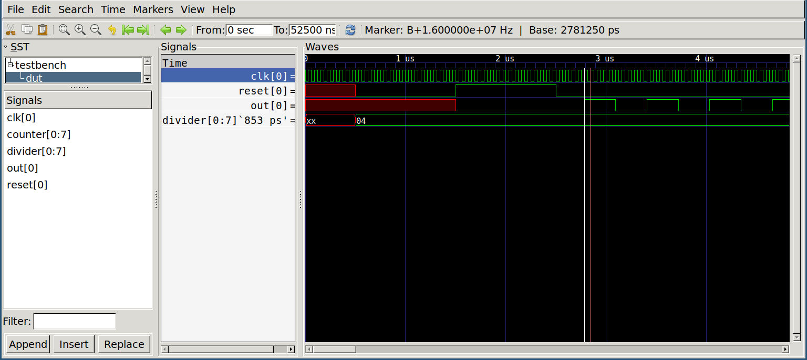

# Simulating verilog "code"

Using Libre/Free tools only

Just a small demo/example/template repository of a iverilog test bench

**make show**

To compile, run and view the result, if rerunning the example consider calling   
*make divider_tb.lxt2* and pressing *ctrl+shift+r* in GTKWave to relaod the waveform instead.